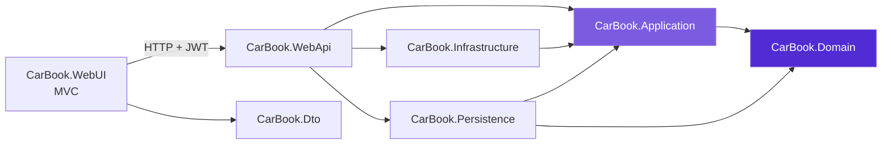

# 🚗 CarBook - Araç Kiralama ve Yönetim Sistemi


CarBook, modern web teknolojileri ve **Clean Architecture (Temiz Mimari)** ilkeleriyle geliştirilmiş; araç kiralama, blog ve yapay zeka entegrasyonunu tek çatı altında toplayan kapsamlı bir yönetim platformudur.

Kullanıcılar sistem üzerinden araç kiralayabilir, blog yazılarını inceleyip yorum yapabilir, admin ile iletişime geçebilir ve **OpenAI destekli Yapay Zeka Asistanı** ile sohbet edebilir. Admin tarafında ise yapay zeka; rezervasyon onay mesajlarını ve iletişim mesajlarına verilecek cevapları otomatik olarak hazırlar.

---

## 📸 Ekran Görüntüleri (Screenshots)

<details>
<summary><b>👤 Kullanıcı Arayüzü (User Interface) - Login, Register ve Kullanıcı Sayfaları - Görselleri Görmek İçin Tıklayın</b></summary>
<br>

---


---


---


---


---


---


---


---


---


---


---


---


---


---


---


---

</details>

<details>
<summary><b>👨‍💼 Admin Paneli (Admin Interface) - Görselleri Görmek İçin Tıklayın</b></summary>
<br>

---


---


---


---


</details>

---

## 🏗️ Proje Mimarisi (Solution Structure)

Proje, katmanlı mimarinin endişelerin ayrılması (separation of concerns) prensibine tam uygun olarak geliştirilmiştir:

```text
Solution 'CarBook'
│
├── Core
│   ├── CarBook.Application    # İş mantığı, CQRS Handlers, DTOs, Validations, Behaviors, Interfaces
│   └── CarBook.Domain         # Varlıklar (Entities) ve temel nesneler
│
├── Frontends
│   ├── CarBook.Dto            # Veri taşıma nesneleri (Data Transfer Objects)
│   └── CarBook.WebUI          # Kullanıcı Arayüzü (ASP.NET Core MVC / Razor Views)
│
├── Infrastructure
│   ├── CarBook.Infrastructure # Harici servisler, Repository implementasyonları, Options
│   └── CarBook.Persistence    # Veritabanı context, Migrations, Seeders ve Entity Configurations
│
└── Presentation
    └── CarBook.WebApi         # Web API katmanı (Endpoints, Controllers, Custom Middlewares)
```

---

## 🔀 Katmanlar Arası Bağımlılık

Bağımlılıklar her zaman **dıştan içe** doğrudur. `Domain` katmanı hiçbir katmana bağımlı değildir.



---

## 🚀 Kullanılan Teknolojiler

| Alan | Teknoloji | Amaç |
|---|---|---|
| Platform | **.NET 8 / C#** | Ölçeklenebilir ve sürdürülebilir backend altyapısı |
| Web API | **ASP.NET Core Web API** | Servis katmanı ve endpoint yönetimi |
| Kullanıcı Arayüzü | **ASP.NET Core MVC (Razor Views)** | Kullanıcı ve admin arayüzleri |
| ORM | **Entity Framework Core 8** | Nesne-ilişkisel eşleme, migration yönetimi |
| Veritabanı | **Microsoft SQL Server (MSSQL)** | İlişkisel veri depolama |
| Tasarım Deseni | **CQRS + MediatR** | Okuma/yazma ayrımı, gevşek bağlı handler yapısı |
| Mimari | **Clean Architecture** | Test edilebilir, bağımlılığı yönetilen katmanlı yapı |
| Doğrulama | **FluentValidation** | Gelen verinin kurallarla doğrulanması |
| Hata Yönetimi | **Custom Exception Middleware** | Hataların merkezi olarak yönetilmesi |
| Kimlik Doğrulama | **JWT (JSON Web Token)** | Token tabanlı login ve claim bazlı yetkilendirme |
| Yapay Zeka | **OpenAI API** | Asistan sohbeti, otomatik mesaj ve cevap üretimi |
| E-posta | **SMTP (MailSettings)** | Sistem e-postaları |

---

## 🚘 Öne Çıkan Özellikler

### 🚗 Araç Kiralama Modülü
Gelişmiş araç listeleme, filtreleme ve esnek rezervasyon yönetimi. Kullanıcılar uygun araçları inceleyip rezervasyon oluşturabilir; admin rezervasyonları panelden yönetir.

### 📝 Blog Sistemi
Kullanıcıların blog yazılarını okuyabildiği, detay inceleyebildiği ve yorum yapabildiği interaktif alanlar.

### 📬 İletişim & Destek
Son kullanıcılar ile admin arasında mesajlaşma ve iletişim yönetimi. Admin, gelen mesajlara yapay zeka yardımıyla hazırlanan cevap metniyle hızlıca dönüş yapabilir.

### 🤖 Yapay Zeka Asistanı
Giriş yapan kullanıcıların sistem içerisinde doğrudan sohbet edebildiği, OpenAI destekli akıllı asistan modülü.

### 👤 Kullanıcı Paneli
Kullanıcıların kendi rezervasyonlarını, profillerini ve yaptıkları yorumları düzenleyebildiği, yetkilendirilmiş güvenli alanlar.

### 👨‍💼 Admin Paneli
Araç, rezervasyon, blog, yorum ve iletişim mesajlarının tek yerden yönetilmesi.

---

## 🔐 Kimlik Doğrulama Akışı

Sistem **JWT tabanlı** kimlik doğrulama kullanır:

1. Kullanıcı login olduğunda ilgili **CQRS Handler** içinde JWT token üretilir.
2. Kullanıcıya ait bazı bilgiler (kullanıcı adı, rol, id vb.) **claim** olarak token'a yüklenir.
3. `WebUI` tarafında, controller aşamasında token'a **ek claim'ler** dahil edilir.
4. Sonraki isteklerde token ile yetkilendirme yapılır.

---

## 🧠 Yapay Zeka Entegrasyonu

Projede **OpenAI API** üç farklı senaryoda kullanılır:

| Senaryo | Kullanıcı | Açıklama |
|---|---|---|
| **Rezervasyon onay mesajı** | Admin | Onaylanan rezervasyon için müşteriye gidecek mesaj otomatik üretilir |
| **İletişim mesajı cevabı** | Admin | Gelen iletişim mesajları için cevap metni taslağı hazırlanır |
| **Yapay Zeka Asistanı** | Giriş yapmış kullanıcı | Kullanıcı asistanla sohbet ederek soru sorabilir |

---

## 🛡️ Güvenlik Notları

- API anahtarları, connection string ve JWT ayarları **GitHub'a yüklenmez**; yerel geliştirmede `secrets.json` içinde tutulur.
- Canlı ortamda bu değerler **ortam değişkenleri (environment variables)** veya bir secret manager (Azure Key Vault vb.) ile sağlanmalıdır.
- Gelen tüm istekler **FluentValidation** ile doğrulanır.
- Hatalar, özel middleware ile merkezi olarak yakalanır ve istemciye güvenli biçimde döndürülür.

---

## 📬 İletişim

- **GitHub:** [Yiğit Örücü](https://github.com/YgtOrucu)
- **LinkedIn:** [Yiğit Örücü](https://www.linkedin.com/in/muhsin-yi%C4%9Fit-%C3%B6r%C3%BCc%C3%BC-09214911a/)
- **E-posta:** orucuyigit@gmail.com

> Projeyi beğendiysen ⭐ vermeyi unutma!
